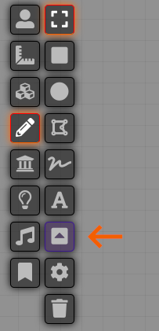
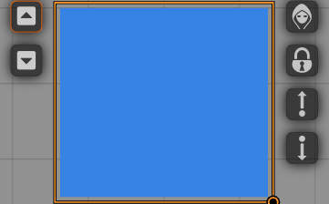

<!--
SPDX-FileCopyrightText: 2021 Johannes Loher

SPDX-License-Identifier: MIT
-->

# Foreground Drawings

[](https://github.com/ghost-fvtt/foreground-drawings/actions)


[](https://forge-vtt.com/bazaar#package=foreground-drawings)
[](https://www.foundryvtt-hub.com/package/foreground-drawings/)
[](https://api.reuse.software/info/github.com/ghost-fvtt/foreground-drawings)
[](https://ko-fi.com/ghostfvtt)


A module for [Foundry Virtual Tabletop] that allows users to create drawings in
the foreground while keeping the ability to also draw in the background. Unlike
background drawings, foreground drawings are not affected by lighting,
sight, or weather effects.

## Installation

To install and use Foreground Drawing, simply paste the following URL into the
**Install Module** dialog on the Setup menu of Foundry Virtual Tabletop.

https://github.com/ghost-fvtt/foreground-drawings/releases/latest/download/module.json

## Usage

In order to create foreground drawings, toggle the foreground drawings layer by
clicking the corresponding button in the drawing tools. You can go back to the
background drawings layer by clicking the button again. It basically works the
same as working with overhead tiles.



You can also move drawings from one layer to the other by using the buttons that
have been added to the left side of the drawing HUD, again, mimicking the
functionality of overhead tiles.



## Development

### Prerequisites

In order to build this module, recent versions of `node` and `npm` are
required. Most likely using `yarn` also works but only `npm` is officially
supported. We recommend using the latest lts version of `node`. If you use `nvm`
to manage your `node` versions, you can simply run

```
nvm install
```

in the project's root directory.

You also need to install the project's dependencies. To do so, run

```
npm install
```

### Building

You can build the project by running

```
npm run build
```

Alternatively, you can run

```
npm run build:watch
```

to watch for changes and automatically build as necessary.

### Linking the built project to Foundry VTT

In order to provide a fluent development experience, it is recommended to link
the built module to your local Foundry VTT installation's data folder. In
order to do so, first add a file called `foundryconfig.json` to the project root
with the following content:

```
{
  "dataPath": "/absolute/path/to/your/FoundryVTT"
}
```

(if you are using Windows, make sure to use `\` as a path separator instead of
`/`)

Then run

```
npm run link-project
```

On Windows, creating symlinks requires administrator privileges, so
unfortunately you need to run the above command in an administrator terminal for
it to work.

[Foundry Virtual Tabletop]: https://foundryvtt.com/
